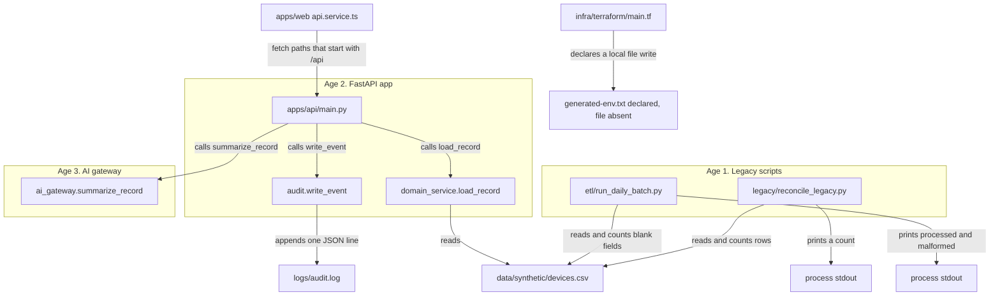

# Current-state architecture

| Field | Value |
|---|---|
| Stage | S01 — Discovery dossier (Execution Plan Phase 1; spine stages 0A, 5, 7) |
| Date / version | 2026-10-09, v1.0 |
| Author | Mangesh (FDE), drafted with Cursor |
| Status | CONDITIONAL PASS. The inventory owner column is Unknown on every row. That is more than half the rows. This file cites files, tests, the audit log, and the replay. It proposes no change. |
| Evidence sources | `docs/architecture/current-state.md`; `docs/ADR/0001-partial-modernization.md`; `apps/api/main.py`; `apps/api/services/domain_service.py`; `apps/api/services/ai_gateway.py`; `apps/api/services/audit.py`; `legacy/reconcile_legacy.py`; `etl/run_daily_batch.py`; `policy/opa/access.rego`; `infra/terraform/main.tf`; `docs/00-setup/replay-log.md`; `docs/00-contract/operating-contract.md` |
| Assumptions | The files on disk are the inherited system plus the S00 and S0B notes. This stage adds notes under `docs/01-discovery/` only. |
| Unresolved issues | No file names an owner for any of the three code ages. The replay log names a test `test_missing_record_returns_first_row`. The file on disk defines `test_legacy_missing_record_behavior_is_characterized`. |
| Residual risks | A reader can treat the diagram as a target. It is a picture of the files that exist today. |

## What this file is

This file maps the inherited system as it runs today. `docs/architecture/current-state.md` names three engineering generations that sit in one repo. This note says what each one reads, what it writes, and what it calls.

Claim labels used below: **Verified Fact** (a file, a test, a log line, or a replay result), **Inference**, **Assumption**, **Unknown**.

## The three generations

`docs/architecture/current-state.md` lines 3 to 7 names them:

1. Legacy batch, files, and scripts under `legacy/` and `etl/`.
2. FastAPI services under `apps/api/`. FastAPI is the Python app that answers HTTP calls.
3. AI-assisted code under `apps/api/services/ai_gateway.py`.

The same file, lines 11 to 13, names three AI products: Network Incident Copilot, Configuration Assistant, and Capacity Intelligence. **Verified Fact:** those names are in that list. A search of the Python files finds no function under those names. `ai_gateway.py` has one function, `summarize_record`.

## Diagram

The policy file `policy/opa/access.rego` is absent from the diagram on purpose. The API checks roles with a Python list. No Python file imports the policy file. **Verified Fact:** `apps/api/main.py` lines 11 to 17; a repo search for `access.rego` finds the policy file and docs, and no call from Python.

## Age 1 — legacy scripts

**Verified Fact.** `legacy/reconcile_legacy.py` and `etl/run_daily_batch.py`.

| | What the code does |
|---|---|
| Reads | Both scripts open `data/synthetic/devices.csv`. The legacy script is lines 9 to 11. The daily batch is lines 8 to 12. |
| Writes | Both print to stdout. The daily batch prints `processed`, `malformed`, and `sample`. Replay section 1.5 shows `{'processed': 354, 'malformed': 1, 'sample': True}`. The comment on line 15 of the batch says malformed records are counted and the script continues. Replay section 1.5 says it writes no quarantine file. The legacy script prints `legacy reconciled` and the row count (lines 13 to 14). Neither script appends `logs/audit.log`. |
| Calls | The legacy script calls `csv.DictReader` and `sum`. It assigns `SHARED_DB_USER = "app_shared"` and `SHARED_DB_PASSWORD` (password `<redacted>`) on lines 5 to 6. The `reconcile` function never uses those two names. No database connect call is in the file. The daily batch calls `argparse` and `csv.DictReader`. The `--sample` flag is stored and printed. It does not change the count. |

**Unknown.** The variable names say "DB". The file contains no database call. Whether a database existed outside this file is Unknown.

## Age 2 — FastAPI app

**Verified Fact.** `apps/api/main.py` builds the app (line 4) and defines three routes.

| | What the code does |
|---|---|
| Reads | `domain_service.load_record` and `list_recent` open `devices.csv` only (`domain_service.py` lines 4 to 5 and 8 to 18). `GET /records/{record_id}` and `POST /ai/summarize/{record_id}` call `load_record`. No route calls `list_recent`. A repo search finds `list_recent` only in `domain_service.py`. |
| Writes | `audit.write_event` appends a JSON line to `logs/audit.log` (`audit.py` lines 5 to 12). The record route writes that line after an allowed read (`main.py` lines 14 to 16). The summarize route writes that line on every call (`main.py` line 23). `GET /health` returns JSON and does not call `write_event`. Replay section 2.1 matches that. A refused role returns `{"error":"forbidden"}` and does not call `write_event` (`main.py` line 17). Replay section 2.6 matches that, including HTTP status 200. |
| Calls | The record route calls `domain_service.load_record` and then `audit.write_event`. The summarize route calls `domain_service.load_record`, then `ai_gateway.summarize_record`, then `audit.write_event`. The health route calls neither. No route calls the policy file, a database, or a hosted model. `requirements.txt` pins `python-dotenv`. No Python file imports `dotenv` or calls `os.getenv`. **Verified Fact:** repo search for `dotenv`, `getenv`, and `environ`. |

The allow list on the record route is `admin`, `operator`, `clinician`, `engineer`, `ai_agent` (`main.py` line 13). The header default is `operator` (line 11). Replay sections 2.4 and 2.5 match the default and the `clinician` allow.

`load_record` returns a row when `record_id` equals any cell in that row (`domain_service.py` line 12). When no cell matches, it returns `rows[0]` (line 15). Replay section 2.3: `GET /records/DOES-NOT-EXIST` returned HTTP 200 and `device_id` `REC-0001`.

## Age 3 — AI gateway

**Verified Fact.** `apps/api/services/ai_gateway.py`.

| | What the code does |
|---|---|
| Reads | The function takes the device dict the API already loaded. It does not open a file. It does not read `AI_GATEWAY_KEY` from `.env.example`. Line 1 imports `os`. The function never calls `os`. |
| Writes | The function returns a dict. It does not open `data/synthetic/ai_invocations.csv`. It does not write the audit log. The route in `main.py` writes the audit log after the function returns. |
| Calls | It builds a prompt from `PROMPT_TEMPLATE` (line 4), waits `time.sleep(0.01)` (line 9), and returns model `local-sim-v1`, a summary string, the sentence "Review and approve before action", a token estimate, `source_count` 1, and `guardrail_status` `not_enforced` (lines 11 to 18). The token estimate is `len(prompt.split()) * 2` (line 10). Replay section 2.7 returned that shape with `token_estimate` 64. There is no HTTP call to a model. |

The three product names in `current-state.md` have no function in this file. **Verified Fact.**

## Ownership and ADR 0001

**Verified Fact.** `docs/ADR/0001-partial-modernization.md`:

- Decision: keep legacy batch jobs while introducing FastAPI services.
- Status: Accepted, but never revisited.
- Consequence: business rules and audit behavior now differ across code paths.

The split is visible in the files above. The legacy script counts rows and writes no audit line. The API writes an audit line for an allowed read and for every summary. The policy file allows any `admin`, and `operator` only when the action is `read` (`access.rego` lines 6 to 11). The API allow list is a different set of strings and includes `clinician` (`main.py` line 13). The domain card lists `noc_operator`, `network_engineer`, `field_engineer`, `customer_support`, `automation_service`, `vendor_account`, and `ai_agent` (`docs/domain-specific-spec.md` lines 20 to 26). `ai_agent` is the only string in both the domain list and the API list.

`docs/domain-specific-spec.md` line 39 says multiple teams appear to own overlapping capabilities. The file does not name the teams and does not assign a file to a team.

**Unknown.** The owner of the legacy script, the owner of the API, and the owner of the gateway.

`docs/00-contract/operating-contract.md` row 4 records a later window to move the shared password out of `legacy/reconcile_legacy.py`. This stage does not edit that script. Row 3 records a later window to change `ai_gateway.py`. This stage does not edit that file.

## What the replay confirms about this picture

**Verified Fact.** `docs/00-setup/replay-log.md` section 4. Health, the `REC-0001` read, the missing-id read, the `clinician` allow, the summary shape, the batch counts, three live routes, and three tests matched Appendix D of `Project_Intent.md` on 2026-10-08.

The same log, section 5, records added observations used in the risk register: the record body includes `mgmt_ip` and `credential_profile`; a missing id is audited under the asked id while the body holds `REC-0001`; a missing role header is treated as `operator`; a refused role returns HTTP 200 and writes no audit line; the summary of a missing id is a summary of `REC-0001`.

## Lifecycle

This file cites `docs/00-setup/replay-log.md` and `docs/00-contract/operating-contract.md`. Stage S02 cites this dossier for behaviours to snapshot. Stage S03 harvests entities and status words from it. Stage S09 reuses the risk register in this same folder.
