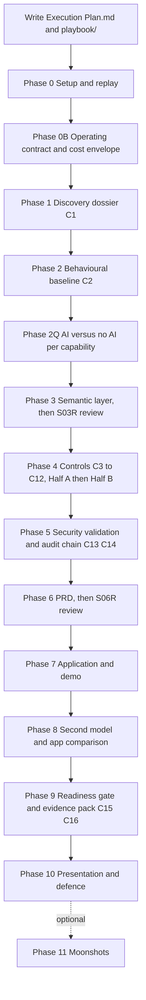

# Execution Plan

| Field | Value |
|---|---|
| Stage | Method layer. Written after `Project_Intent.md`, before any repo work. |
| Date / version | 2026-10-08, v1.0 |
| Author | Mangesh (FDE), drafted with Cursor |
| Status | ACTIVE |
| Evidence sources | `Project_Intent.md`; `AI-FDE_Brownfield_Repo_Transformation_Challenge_Guide.pdf`; `Semantic_Layer_capture.pdf`; `Assignment Material/Prompt_Anatomy.pdf`; `Assignment Material/Prompt Template.pdf`; `Assignment Material/Guidance on how to apply Prompt Anatomy to the 42 step Production Spine v2.docx`; the inherited repo `06-telecom-service-network-incident-ops` |
| Assumptions | The inherited repo is the only system under change. All data is local and synthetic. No cloud account is needed to run it. |
| Unresolved issues | The second model for Phase 8 is not yet named. The demo flow in Phase 6 is a recommendation until the PRD confirms it. |
| Residual risks | Time. Phases 4 to 8 contain the most work. The order below puts analysis first so a partial result still has evidence. |

## 1. What this file is

This file is the ordered work method for the Sprint 3 capstone. `Project_Intent.md` is the locked brief. This file turns that brief into phases. Each phase has an action, a scope with an exclude list, analysis dimensions, evidence rules, output files, a completion gate, and a lifecycle link to earlier and later phases. Those eight parts come from `Prompt_Anatomy.pdf`.

The phases are run from the `playbook/` folder. Each phase has one prompt file there. You open a new Cursor chat, attach the inputs the prompt names, paste the prompt, and check the output against the file list. Section 4 explains the playbook.

## 2. What this plan delivers

The plan covers six sources.

- The 16 core challenges and the six-step product path in `AI-FDE_Brownfield_Repo_Transformation_Challenge_Guide.pdf`. Moonshots are an optional last phase.
- The five format rules and the folder tree in `Semantic_Layer_capture.pdf`.
- The locked answers, deliverables D0 to D8, and the ten defence questions in `Project_Intent.md`.
- The eight prompt parts in `Prompt_Anatomy.pdf`: Action, Scope, Constraints, Analysis Dimensions, Evidence Rules, Artifact Generation, Completion Gate, Lifecycle Linkage.
- The prompt shell in `Prompt Template.pdf`: artifact header, four evidence labels, Exclude list, per-finding format, stage status PASS / CONDITIONAL PASS / BLOCKED, and the seven-item final response.
- The trainer guidance docx: one prompt per stage; analysis and evidence before code; a read-only orientation, an operating contract, and an AI-versus-no-AI decision before any architecture or code change.

## 3. Where files go

All repo paths below sit under `06-telecom-service-network-incident-ops/` unless the path starts with the project root.

| What | Where | Note |
|---|---|---|
| This plan and the playbook | Project root: `Execution Plan.md`, `playbook/` | Outside the inherited repo. |
| Setup evidence | `docs/00-setup/` | Phase 0. |
| Operating contract, cost envelope, crosswalk | `docs/00-contract/` | Phase 0B. |
| Challenge evidence | `docs/01-discovery/` to `docs/16-evidence-pack/` | One folder per challenge. Challenge 16 also fills `PRODUCTION_EVIDENCE_PACK.md` at the repo root. `scripts/sanity_check.py` forbids four workshop paths under `docs/`; these folder names avoid them. |
| Crosswalk to the 42-stage spine | `docs/00-contract/challenge-to-spine-crosswalk.md` | Maps each challenge folder to the spine stage folder names (`00-preflight`, `05-current-state`, `07-repo-assessment`, and so on). A reviewer who thinks in spine stages can find each artifact. |
| Semantic layer | `semantic-layer/` | The exact tree from `Semantic_Layer_capture.pdf`, plus `generated/` and `build.py`. `generated/` holds the JSON that the fifth format rule ("Generated JSON serves it") requires. The README in that folder says why those two items were added. |
| Pipeline evidence | `evidence/` | SBOM, scan output, test reports. Written by CI and by `make evidence`. |
| Evidence pack | `PRODUCTION_EVIDENCE_PACK.md` | Next to the empty template. Filled section by section in Phase 9. |
| PRD, demo, model comparison, defence | `docs/prd/`, `docs/demo/`, `docs/model-comparison/`, `docs/defence/` | Phases 6, 7, 8, 10. |
| New tests | `tests/characterization/`, `tests/access/`, `tests/ai/`, `tests/reliability/`, `policy/tests/` | Phases 2, 4, 5. |
| Chat log | Project root: `transcript/chat_transcript.md` | Every turn. |

## 4. Rules that apply to every phase

- Every phase is run from one playbook prompt. The prompt has the eight Prompt Anatomy parts. There is no single giant prompt.
- Every artifact starts with a header: stage, date and version, author, status, evidence sources, assumptions, unresolved issues, residual risks. This is the header from `Prompt Template.pdf`. The header at the top of this file is an example.
- Every claim carries one label: Verified Fact, Inference, Assumption, or Unknown. A file path, a test name, a log line, or a replay result backs each Verified Fact.
- Every material finding states six things: the finding, the evidence, the impact, the risk, the confidence, and the open questions.
- Every phase ends with the Prompt Template final response. It has seven items: stage status (PASS, CONDITIONAL PASS, or BLOCKED), key findings, major risks, assumptions and unknowns, artifacts created, blocking issues, recommended next action. A BLOCKED phase stops the next phase until the block is cleared.
- Analysis and evidence come before code. Phases 0 to 3 make no change to the application. In Phase 4 each challenge has an analysis half that must reach PASS or CONDITIONAL PASS before its code half starts.
- Every number the demo shows carries one honesty label: REAL, PRECOMPUTED, SIMULATED, or EDUCATIONAL. `Project_Intent.md` Appendix B defines them.
- No severity cutoff and no SLA threshold is invented. A proposed number is marked PROPOSED and names the owner who must confirm it.
- YAML in `semantic-layer/` is the source of truth. If a later file disagrees with the YAML, fix the file or write an ADR.
- Each chat turn is appended to `transcript/chat_transcript.md`.
- Documents use plain speech: short sentences, everyday words, the real name and the real action.

## 5. Phase order

The phases run in one line. No phase is skipped. Each phase starts after the one before it reaches PASS or CONDITIONAL PASS.

Some later phases read outputs from more than one earlier phase. Those reads are not extra paths through the work. They are listed under "Lifecycle linkage" in each phase and summarised here.

| Later phase | Reads these earlier outputs | Why |
|---|---|---|
| Phase 3 Semantic layer | Phase 1 dossier, Phase 2 data-quality baseline and defect list, Phase 2Q table | Entities, status words, rules, and the per-use AI agency come from them. |
| Phase 4 Controls | Phase 1, Phase 2, Phase 2Q, Phase 3 YAML ids | Each design cites the evidence and uses YAML ids. |
| Phase 6 PRD | Phase 2Q table, Phase 3 YAML, Phase 4 designs, Phase 5 provenance model | The PRD quotes the AI picks, cites YAML ids, and requires controls that already have a design. |
| Phase 7 Application | Phase 6 PRD, Phase 3 YAML, Phase 4 Half B tests | Build only what the PRD names. |
| Phase 8 Second model | Phase 3 YAML, Phase 6 PRD, Phase 7 tests | Same inputs to both apps. |
| Phase 9 Readiness | Every earlier completion gate, Phase 0B contract, Phase 5 compliance mapping | The pack points at all of it. |

Why this order:

- Phase 0B comes before discovery. The trainer guidance says to write down what may change before anything is read in depth.
- Phase 2Q comes before the semantic layer. The guidance says the AI-versus-no-AI decision comes before any architecture, and `ai-context-policy.yaml` copies its agency and approval points from the Phase 2Q table.
- Phase 3 comes before Phase 4. The access matrix, the policy inputs, the AI context policy, and the metrics all reuse YAML ids.
- Phase 4 and Phase 5 come before Phase 6. The PRD can then require controls that already have a design and a provenance model.
- Phase 6 comes before Phase 7. The app is built only from the PRD.
- Phase 7 comes before Phase 8. The second model's app runs the same tests as the first.
- Phase 9 comes last before the defence. The pack can only point at files that exist.

## 6. The playbook

Location: `playbook/` at the project root.

Files:

- `playbook/README.md`. How to use the playbook: open a new Cursor chat per stage, attach the files the prompt lists, paste the prompt whole, check the output against the expected-output list, record the stage status, then move on. It also holds the final hand-back checklist.
- One file per stage, named `playbook/SNN-<short-name>.md`. The stages are: S00 setup and replay; S0B operating contract and cost envelope; S01 discovery; S02 baseline; S2Q AI qualification; S03 semantic layer; S03R semantic-layer review; S04-03 to S04-12, one file per Phase 4 challenge; S05-13 security validation; S05-14 audit chain; S06 PRD; S06R PRD review; S07 application and demo; S08 second-model brief and comparison; S09 readiness and evidence pack; S10 defence.

Each stage file has the same parts, in this order:

- Inputs to attach.
- The prompt, in a fenced block, in the Prompt Template shell: Objective, Scope with Include and Exclude, Required Analysis, Evidence Rules, Constraints and Guardrails, Required Artifacts with paths, Completion Gate, Lifecycle Linkage, Required Final Response.
- Locked facts copied from `Project_Intent.md` section 4.3, so the model does not re-derive or invent them.
- Expected output list: file name and what it must contain.
- Done test.

The two review prompts (S03R and S06R) read a generated draft against a short failure list. The reviewer writes one row per item: PASS, FAIL, or NOT APPLICABLE, with a file citation. The failure list comes from the trainer guidance: code before analysis; architecture before AI qualification; AI used because it is an AI project; output without evidence; missing artifact; skipped gate; invented cutoff; a second meaning outside the YAML.

Done test for the playbook: each stage file has all eight anatomy parts; each Required Artifacts path matches a path in this file; no prompt asks for code before its analysis gate.

## 7. Phases

### Phase 0. Setup and first replay

Action: establish the running baseline of the inherited repo without changing it.

Scope: venv, tests, sanity check, ETL sample, the three live routes. Exclude: any edit to application code, tests, data, or configuration.

Steps:

- Create a venv, install `requirements.txt`, run `pytest -q`, `python scripts/sanity_check.py`, `python etl/run_daily_batch.py --sample`.
- Start uvicorn. Replay the four calls named in `Project_Intent.md` 6.1: `GET /health`, `GET /records/REC-0001`, `GET /records/DOES-NOT-EXIST`, `POST /ai/summarize/REC-0001`. Save request and response bodies.
- Save `logs/audit.log` as written by those calls.

Analysis dimensions: tool versions, test results, route behaviour, audit output.

Lifecycle linkage: cites `Project_Intent.md` Appendix D. Feeds Phase 1 and Phase 2.

Outputs: `docs/00-setup/replay-log.md`, `docs/00-setup/tool-versions.md`.

Completion gate: the three commands and four calls ran, and the saved outputs match `Project_Intent.md` Appendix D.

### Phase 0B. Operating contract and cost envelope (spine stages 0B and 0C)

Action: write down what this work may change and what it may not, and a first cost envelope, before any deep reading.

Scope: repository write boundaries, data use, production access, human approval triggers, stop conditions, a provisional cost view. Exclude: any decision about which AI to use. That is Phase 2Q.

Steps:

- Answer the operating-contract questions for this repo: may database schemas change, may API routes change, may the AI gateway change, may legacy scripts change, is the Angular UI in scope, are the CSVs read-only, who approves a code change, what stops the work. Where the packet is silent, write PROVISIONAL and name who must confirm.
- Write the provisional cost envelope from the files that exist: `ai_invocations.csv` token counts, `events.jsonl` cost fields, the `local-sim-v1` stub. Scenarios: deterministic rules, conventional automation, a hosted model. Mark every number EDUCATIONAL or PRECOMPUTED. Write Unknown where the repo has no figure.
- Write the challenge-to-spine crosswalk.

Analysis dimensions: scope, permissions, data boundaries, approval triggers, cost assumptions.

Lifecycle linkage: cites `Project_Intent.md` 2.3, 3.1, and 4.3. Reconciled in Phase 2Q (AI decision) and Phase 9 (readiness).

Outputs: `docs/00-contract/operating-contract.md`, `docs/00-contract/cost-envelope.md`, `docs/00-contract/challenge-to-spine-crosswalk.md`.

Completion gate: every write boundary is stated as allowed, prohibited, or PROVISIONAL with an owner; no number in the cost envelope lacks an honesty label.

### Phase 1. Discovery dossier (Challenge 1, D1; spine stages 0A, 5, 7)

Action: understand the inherited system. Do not improve it.

Scope: every file in `Project_Intent.md` 4.2 and the Phase 0 outputs. Exclude: refactoring, redesign, target architecture, any file edit inside the repo other than new files under `docs/01-discovery/`.

Analysis dimensions: architecture, components, business flows, data, integrations, AI touchpoints, ownership, risk.

Lifecycle linkage: cites the Phase 0 replay and the Phase 0B operating contract. Feeds Phase 2, Phase 3, and the risk registers in Phase 9.

Steps:

- Map the three generations named in `docs/architecture/current-state.md`: legacy script, FastAPI, AI gateway.
- Inventory each component, route, script, data file, test, policy, and workflow with a one-line job and an owner (or Unknown).
- Reconstruct the four business flows from `docs/domain-specific-spec.md`. For each, mark which routes exist today. Today none of the four runs end to end.
- Map data: six CSVs, `events.jsonl`, `manifest.json`, `quality_issues.json`, and which table the API reads (`devices.csv` only).
- Map integrations: UI fetch wrapper to API, API to CSV, API to AI stub, audit to `logs/audit.log`, Terraform to a text file.
- Record AI touchpoints: `ai_gateway.py`, the three AI products named in current-state, `ai_invocations.csv`, `guardrail_status: not_enforced`.
- Record ownership boundaries and the ADR 0001 split (legacy batch kept, never revisited).
- Write the risk register. Start from `docs/architecture/known-gaps.md` and add what it misses: `clinician` role in a telecom API, missing-id fallback, first key `REC-0001` reused across tables, OpenAPI documents one of three routes.

Outputs (the challenge deliverables, in order): `docs/01-discovery/current-state-architecture.md`, `component-inventory.md`, `business-flow-reconstruction.md`, `data-and-integration-map.md`, `ai-subsystem-discovery.md`, `brownfield-risk-register.md`.

Completion gate: every row cites a file, test, log, or replay result, and no row proposes a change.

### Phase 2. Behavioural baseline (Challenge 2, D2; spine stage 7)

Action: capture current behaviour before anything changes it.

Scope: Phase 0 replay, `tests/`, `data/synthetic/`, `etl/`, `legacy/`. Exclude: fixing any defect found; changing any existing test.

Analysis dimensions: test coverage, route behaviour, script behaviour, data quality, intended behaviour versus defect.

Lifecycle linkage: cites Phase 0 and Phase 1. Feeds Phase 3 (status words and rules), Phase 4 (defects to fix), and the before-and-after comparison in Phase 5.

Steps:

- Record the pytest result as the baseline test report. Three tests today.
- Write the behaviour snapshot per route and per script: input, output, side effect.
- Add characterization tests that do not change the app, for: missing id returns the first row; `clinician` is allowed; summarize has no role check; ETL counts blanks and does not quarantine; the legacy script holds a password constant.
- Profile each CSV and `events.jsonl` with a script in `docs/02-baseline/profile_data.py`: row counts against `manifest.json`, blanks per column, duplicate keys, `last_seen_at` before `first_seen_at`, out-of-range `retry_count`, severity vocabulary (`gold`, `bronze`), malformed `ai_call_id`, null or blank `correlation_id`. Confirm each item in `quality_issues.json` against the files.
- Split findings into two lists: intended legacy behaviour to keep, and defects to fix. The missing-record fallback goes in the defect list.

Outputs: `docs/02-baseline/baseline-test-report.md`, `behaviour-snapshot.md`, `data-quality-baseline.md`, `defect-list.md`, `profile_data.py`; `tests/characterization/test_*.py`.

Completion gate: a reader can point to one behaviour kept and one defect to fix, and the two lists do not overlap.

### Phase 2Q. AI versus no AI, per capability (spine stage 8)

Action: decide, for each capability, whether it needs a model at all, and how much agency it may have. Do this before the semantic layer's AI policy, before any architecture, and before the PRD.

Scope: the four business flows and the three AI products named in `docs/architecture/current-state.md`. Exclude: choosing a vendor or model name; writing code.

Steps:

- Build one table. Rows: order qualification; provisioning retry and rollback; alarm dedupe; alarm-to-incident correlation; topology lookup; incident summary; next-action recommendation; configuration suggestion; capacity forecast; remediation execution; remediation validation. Columns: what the step does today (cite the file or write Not implemented); options considered (rules, workflow automation, deterministic code, classical ML, GenAI, agentic AI); the pick; why that pick needs no more intelligence than stated; the agency allowed (analyse, recommend, decide, execute); the human approval point.
- Expected shape, to be confirmed against evidence: alarm dedupe by `dedupe_key` and `storm_batch_id` is deterministic; missing-id handling is deterministic; incident summary and next-action recommendation may use GenAI with RECOMMEND_ONLY or HOLD_FOR_REVIEW; remediation execution is never AI-executed in this packet.
- Reconcile the Phase 0B cost envelope. Drop the AI cost rows for any capability that the table assigns to rules.

Analysis dimensions: uncertainty, language, reasoning, generation, adaptive decision need, risk, reversibility, cost.

Lifecycle linkage: cites Phase 1 flows, Phase 2 defects, and the Phase 0B cost envelope. Feeds `ai-context-policy.yaml` in Phase 3, the Challenge 9 design in Phase 4, and the AI limits section of the PRD in Phase 6.

Outputs: `docs/02-baseline/ai-qualification.md`; an update to `docs/00-contract/cost-envelope.md`.

Completion gate: every row has a pick and a reason; no row picks GenAI or agentic AI without a stated need that rules cannot meet; the human approval point is named for every row with agency above analyse.

### Phase 3. Semantic layer (product path step 1, D3)

Action: extract the shared meaning set that the PRD, the policies, the app, and the second model will all consume.

Scope: Phase 1 and 2 outputs, the Phase 2Q table, `docs/domain-specific-spec.md`, status words from code, docs, and CSVs. Exclude: application code; a second meaning file anywhere outside `semantic-layer/`.

Analysis dimensions: entities, relationships, status vocabulary and collisions, business rules, metrics, access semantics, AI context and limits.

Lifecycle linkage: cites Phases 1, 2, and 2Q. Feeds Phases 4, 6, 7, and 8. Reviewed by playbook stage S03R before Phase 4 starts.

Steps:

- Harvest vocabulary: entity fields from the domain spec, roles from `main.py`, personas from the spec, OPA roles, status words from each CSV column, AI fields from `ai_invocations.csv` and `ai_gateway.py`.
- Write the YAML files. Each entity, status, rule, metric, role, and policy gets a stable id (for example `rule.missing_id_not_other_device`). Mark which fields the API reads today.
- `status-taxonomy.yaml` lists allowed values and a `collisions` block: `gold` and `bronze` used as incident severity; status words in `hostname` and `vendor`; `REC-0001` as the first key in six tables.
- `business-rules.yaml` holds at least: a missing id must not return another device; AI output cannot execute; alarm `last_seen_at` cannot precede `first_seen_at`; a shared admin account is not least privilege; duplicate `dedupe_key` is one alarm.
- `access-semantics.yaml` maps the seven domain personas to actions, resources, purpose, and risk. `clinician` is not a telecom role and is listed under removed roles.
- `ai-context-policy.yaml` names fields allowed into a prompt, fields never allowed (`mgmt_ip`, `credential_profile`), the required output schema, model provenance fields, the four outcomes RECOMMEND_ONLY, HOLD_FOR_REVIEW, BLOCK, EXECUTE, and fail-to-person on timeout or schema failure.
- `glossary.md` explains each term in everyday words. `README.md` says Markdown explains, YAML defines, JSON Schema validates, tests protect, generated JSON serves.
- `schemas/semantic-layer.schema.json` validates every YAML file.
- `tests/test_semantic_layer.py` fails when a required entity, status, rule, or persona is missing, when the glossary and YAML disagree on a term, or when a generated JSON file differs from its YAML.
- `build.py` generates `generated/*.json` from YAML. No hand edits in `generated/`.

Outputs: the full tree from `Semantic_Layer_capture.pdf` plus `generated/` and `build.py`.

Completion gate: schema tests pass; every item in `Project_Intent.md` 6.2 is ticked; `generated/` is reproduced by running `build.py`; the S03R review has no open FAIL.

### Phase 4. Controls (Challenges 3 to 12, D4)

Each challenge runs in two gated halves. Analysis and evidence come before code.

- Half A, analyse and design. Produce the challenge's expected deliverables as documents under `docs/NN-<challenge>/`. Cite the Phase 1 and 2 evidence. End with the stage status. No code change in this half.
- Half B, implement and prove. Only after Half A is PASS or CONDITIONAL PASS. Make the code change named in the design, add its test, and record the before-and-after evidence. Code changes stay small and reviewable. A characterization test that locks a defect is replaced in the same commit that fixes the defect.

The analysis dimensions for every challenge are the ones in its challenge-guide execution focus. The lifecycle linkage for every challenge is: cite Phase 1, Phase 2, Phase 2Q, and the semantic-layer ids it uses; feed Phase 5, Phase 6, and Phase 9.

#### Challenge 3. Identity and least privilege

- Half A: current role matrix (API allow list, OPA roles, seven personas, `app_shared`, vendor token, `ai_agent`); target access matrix (persona by resource by action by purpose by risk, from `access-semantics.yaml`); policy input model (role, resource, purpose, scope, risk) written as the OPA input schema; negative access test plan; privilege reduction backlog (remove `clinician`, split `app_shared`, scope `automation_service`, remove the default role header).
- Half B: write the negative access tests: `noc_operator` may read a record; `clinician` is denied; `ai_agent` may recommend and may not execute; `automation_service` may not execute without an approval id. Remove `clinician` from `main.py`.
- Outputs in `docs/03-identity/`; tests in `tests/access/`.
- Completion gate: each allow decision in the tests names role, resource, purpose, scope, and risk.

#### Challenge 4. Secrets and encryption

- Half A: secrets inventory (the password constant in `legacy/reconcile_legacy.py` and `.env.example`, the example AI key, the vendor token, `shared_user=app_shared` in Terraform); remediation plan; cleaned configuration model (`.env.example` holds placeholders only; a settings loader reads the environment and has no real default); sensitive-field handling checklist (`mgmt_ip`, `credential_profile`, `customer_id` in logs and prompts); rotation evidence plan.
- Half B: a secret-pattern test runs in CI and fails on the known strings; the settings loader replaces the constants.
- Outputs in `docs/04-secrets/`.
- Completion gate: no sensitive value is needed in committed code or in the example file, and the pattern test passes.

#### Challenge 5. Infrastructure as code

- Half A: IaC gap report (`main.tf` writes a text file; venv steps are implicit; no container; no environment split); reproducible setup guide; environment model (local, CI); configuration ownership map; deployment dependency list.
- Half B: add `scripts/bootstrap` (or a `make setup` target) and a container file so a fresh clone runs tests with one command. Terraform is corrected to declare variables without a shared user, or marked as a documented gap with an ADR.
- Outputs in `docs/05-iac/`.
- Completion gate: a fresh clone follows the guide and passes tests; the run is recorded.

#### Challenge 6. Policy as code

- Half A: policy catalogue (access, AI approval, data use, operational safety, production readiness); the policy design for `ai_action` with the four outcomes and the EXECUTE conditions (policy allow, an approval id when `approval_required`, an audit row); allow and deny example inputs written as JSON fixtures; exception-handling model (who may waive a rule, how long, where it is logged).
- Half B: extend `policy/opa/access.rego` with resource, purpose, and risk inputs. Add `policy/opa/ai_action.rego`. Policy tests via `opa test` when the binary is present; otherwise a Python evaluator with the same fixtures, and the binary gap is recorded as Unknown. The API calls the policy on every record read and every AI recommendation.
- Outputs in `docs/06-policy/`, `policy/opa/`, `policy/tests/`.
- Completion gate: the high-risk decision "an AI remediation recommendation becomes a change" has a passing allow case and a passing deny case.

#### Challenge 7. CI/CD and supply chain

- Half A: pipeline improvement plan; dependency risk register (extend the three rows); SBOM recommendation (CycloneDX); security scan plan (`pip-audit`, `bandit`, secret-pattern test, policy tests, semantic-layer tests); release evidence checklist.
- Half B: `.github/workflows/ci.yml` gains stages: install, lint, unit and characterization tests, semantic-layer tests, policy tests, SBOM, scans, and an evidence upload to `evidence/`. A `make evidence` target does the same locally.
- Outputs in `docs/07-cicd/`, `evidence/`.
- Completion gate: the pipeline writes evidence files, and the checklist points at them.

#### Challenge 8. Observability and traceability

- Half A: trace design (one `correlation_id` carried from UI to API to policy to AI to approval to audit); log schema (`ts`, `correlation_id`, `actor`, `role`, `action`, `resource`, `policy_decision`, `approval_id`, `model`, `model_version`, `prompt_hash`, `tokens`, `latency_ms`, `outcome`); metric catalogue; dashboard sketch; SLO proposal (API availability, recommendation latency, audit completeness; numbers PROPOSED with owner); one incident reconstruction from `events.jsonl` plus `audit.log`.
- Half B: `audit.py` writes the log schema; every route takes or creates a `correlation_id`.
- Outputs in `docs/08-observability/`.
- Completion gate: one business event is explained end to end from the stored rows.

#### Challenge 9. AI security and guardrails

- Half A: AI risk register; trust-boundary diagram (prompt, retrieved record, model, output, action); guardrail test pack as a list of cases; model provenance design; approval workflow; unsafe-output handling rules. Each AI use cites its row in the Phase 2Q table.
- Half B: `ai_gateway.py` gets a prompt allow-list from `ai-context-policy.yaml`, a Pydantic output schema, a timeout, prompt-injection tests (instruction text placed in `hostname`), a stale-topology check (`stale_topology_flag`), and fail-to-person: timeout or schema failure returns HOLD_FOR_REVIEW with no synthetic summary.
- Outputs in `docs/09-ai-guardrails/`; tests in `tests/ai/`.
- Completion gate: no path lets a recommendation become an action without a policy result, an approval id, and an audit row.

#### Challenge 10. Performance and scalability

- Half A: performance baseline (the record route re-reads `devices.csv` on every call; measured with a timing script over the 354 rows and over an alarm storm selected by `storm_batch_id`; AI stub latency); bottleneck list; load scenarios (alarm storm, 3000-event replay, order retries); scaling recommendations (load once and index by id, batch dedupe, async AI call); data-access findings. Each finding names the business effect, for example SLA breach risk on a circuit.
- Half B: load the CSV once and index by id; re-run the timing script and record before and after.
- Outputs in `docs/10-performance/`.
- Completion gate: each bottleneck row has a business impact column filled in.

#### Challenge 11. Reliability and failure engineering

- Half A: failure-mode catalogue from `docs/runbooks/failure-injection-drills.md` (missing correlation id, AI timeout, duplicate replay, stale master data, partial batch failure); idempotency plan (`dedupe_key`, order `retry_count`, event replay keyed by `correlation_id`); retry and circuit-breaker strategy; degraded-mode design (AI down: health and record read continue; recommendation returns HOLD_FOR_REVIEW); completed `docs/runbooks/incident-response.md` with severity, triage, rollback, comms, and evidence.
- Half B: each drill becomes a test; recovery evidence is recorded from the runs.
- Outputs in `docs/11-reliability/`; tests in `tests/reliability/`.
- Completion gate: the design states what continues when each dependency fails, and the drill tests pass.

#### Challenge 12. Cost and AI FinOps

- Half A: AI cost baseline from `ai_invocations.csv` `token_count` and `events.jsonl` cost fields; cost per workflow by `event_type`; retry cost analysis from `service_orders.retry_count`; optimization backlog; FinOps dashboard fields. Metrics come from `metrics.yaml`: tokens per invocation, cost per correlated incident, quarantine rate, retry count. The baseline reconciles with the Phase 0B cost envelope and the Phase 2Q picks.
- Half B: the gateway records `tokens` and `latency_ms` per call in the audit row. The token formula `len(prompt.split()) * 2` is labelled EDUCATIONAL until a real tokenizer is used.
- Outputs in `docs/12-finops/`.
- Completion gate: cost is stated per business outcome, not only as a total.

### Phase 5. Security validation and audit chain (Challenges 13 and 14)

Action: prove the Phase 4 controls with tests and a rebuildable decision chain.

Scope: the tests and audit rows from Phase 4. Exclude: new controls not designed in Phase 4.

Analysis dimensions: abuse cases, bypass paths, sensitive-data exposure, provenance completeness, unproven facts.

Lifecycle linkage: cites Phase 2 (before) and Phase 4 (after). Feeds Phase 9 and the evidence pack.

#### Challenge 13. Automated security validation

- Half A: security test suite plan; negative test list (unauthorized access, policy bypass, prompt injection, sensitive data in logs and prompts, insecure defaults, unsafe AI action); scanning checklist; abuse-case evidence; remediation backlog.
- Half B: the tests from Challenges 3, 4, 6, and 9 are collected into one `pytest -m security` run that CI executes.
- Outputs in `docs/13-security-validation/`.
- Completion gate: every security claim in the evidence pack names a test that CI runs.

#### Challenge 14. Auditability and compliance evidence

- Half A: audit gap report (today: timestamp, action, record id, model name only); decision provenance model (actor, request, data used, model and version, policy result, approval, final action, trace id, and what cannot be proven); evidence chain for one case; compliance evidence mapping; before-and-after audit example (`POST /ai/summarize/REC-0001` before; the governed recommendation route after).
- Half B: a `/audit/{correlation_id}` route rebuilds the case from stored rows.
- Outputs in `docs/14-audit/`.
- Completion gate: the chain shows what happened, who or what influenced it, and the unproven items.

### Phase 6. PRD (product path step 2, D5)

Action: write the product requirements that both the first app and the second model will build from.

Scope: the semantic layer, the Phase 2Q table, Phase 4 and 5 designs. Exclude: code; any term that is not in the YAML.

Analysis dimensions: users, workflows, AI limits, data, risk, non-functional needs, acceptance checks, success metrics.

Lifecycle linkage: cites Phases 2Q, 3, 4, 5. Feeds Phases 7 and 8. Reviewed by playbook stage S06R before Phase 7 starts.

Steps:

- Classify the four flows and three AI products as in `Project_Intent.md` 5.2, using the Phase 2Q table as the source. The AI limits section quotes the Phase 2Q pick and agency for every AI use.
- Pick the demo flow. Recommended: topology lookup to AI recommendation, extended to a human decision, with alarm-storm dedupe as the deterministic analysis step. This flow exercises policy, guardrails, approval, and audit. The PRD may choose another flow and say why.
- Write the PRD: users, workflows, AI limits, data, risk, non-functional needs, acceptance checks, success metrics. Every requirement cites a YAML id. Every acceptance check names a test.
- State which routes the app will not implement and which inherited gaps stay visible.

Outputs: `docs/prd/prd.md`, `docs/prd/traceability.md`.

Completion gate: every requirement traces to a YAML id; the PRD and YAML do not disagree; the S06R review has no open FAIL.

### Phase 7. Application and demo (product path steps 3 and 4, D6)

Action: build the governed application the PRD describes and show one case end to end.

Scope: `apps/api/`, a small served page, the OpenAPI fragment, the demo script. Exclude: any route the PRD does not name; any EXECUTE path before the four gates exist; wiring the Angular scaffold unless time allows.

Analysis dimensions: route behaviour against the PRD, gate order (policy, approval, audit before state change), honesty labels, failure handling.

Lifecycle linkage: cites the PRD, the YAML ids, and the Phase 4 Half B tests. Feeds Phase 8 (the same tests run on both apps) and Phase 9.

Steps:

- Build from the PRD inside `apps/api/`: `/health`; `/records/{id}` returns 404 on a missing id; `/alarms/storms/{storm_batch_id}` correlates by `dedupe_key`; `/ai/recommend/{id}` runs policy, prompt allow-list, schema, timeout, and returns one of the four outcomes; `/approvals/{id}` records the human decision; `/audit/{correlation_id}` rebuilds the case. No EXECUTE route until all four gates exist. If one is built, it is reversible and validated.
- UI: a small served page (static HTML or FastAPI templates) that walks the flow. The Angular scaffold stays documented as a scaffold unless time allows wiring it.
- Update `data/contracts/openapi-fragment.yaml` to the full route set.
- Demo script with one case: event, data used, policy result, model and version, human decision, audit rebuild. Each number has its honesty label.

Outputs: code and tests; `docs/demo/demo-script.md`; `docs/demo/demo-recording-notes.md`.

Completion gate: the demo completes one flow to a human decision; the audit row is written before any state change; an AI timeout sends the case to a person with no fake summary.

### Phase 8. Second model and app comparison (product path steps 5 and 6, D7)

Action: test whether the semantic layer carries meaning across models.

Scope: a second model, the unchanged `semantic-layer/`, the PRD, `apps/api_model_b/`. Exclude: edits to the YAML during the test; any hint to the second model outside the brief.

Analysis dimensions: status words, rule ids, routes, test results, guardrail outcomes, latency and cost, invented meaning.

Lifecycle linkage: cites Phases 3, 6, 7. Feeds Phase 9 and defence question 9.

Steps:

- Name the second model. Give it the unchanged `semantic-layer/` tree, the PRD, and the same build brief. Do not add a private glossary.
- It builds its app in `apps/api_model_b/` (or a branch). The same semantic-layer tests, contract tests, policy tests, and guardrail tests run against both apps.
- Compare: status words used, rule ids honoured, routes built, test pass counts, guardrail outcomes on the same abuse inputs, latency and token cost, and places where the second model invented meaning.

Outputs: `docs/model-comparison/second-model-brief.md`, `second-model-run-log.md`, `app-comparison.md`.

Completion gate: meanings did not drift; differences are written; the YAML was unchanged during the test.

### Phase 9. Readiness gate and evidence pack (Challenges 15 and 16, D8)

Action: decide what is ready and assemble the proof.

Scope: every artifact from Phases 0 to 8. Exclude: new work; claims without a file pointer.

Analysis dimensions: readiness per control, residual risk, risk owner, deferred work, evidence completeness.

Lifecycle linkage: cites every earlier completion gate and the Phase 0B operating contract (what was allowed to change and what was not). Feeds Phase 10.

#### Challenge 15. Production readiness gate

- Readiness checklist, residual risk register, go/no-go decision, risk owner table, deferred work list.
- Outputs in `docs/15-readiness/`.
- Completion gate: the decision states what is ready, what is not, and which risk is accepted by whom.

#### Challenge 16. Production evidence pack

- Fill `PRODUCTION_EVIDENCE_PACK.md` from the template headings. Each section links to the test, policy, log, trace, AI evaluation, scan, runbook, and readiness file that proves it. Add an executive summary and the challenge-to-spine crosswalk.
- Outputs: `PRODUCTION_EVIDENCE_PACK.md`, `evidence/`, `docs/16-evidence-pack/` (build notes).
- Completion gate: a reviewer can check each claim from the pack without a spoken tour.

### Phase 10. Presentation and defence

Action: present D1 to D8 and answer the ten defence questions with evidence.

Scope: the evidence pack and the earlier artifacts. Exclude: new claims not already in an artifact.

Lifecycle linkage: cites the evidence pack.

Steps:

- A walkthrough of D1 to D8.
- Written answers to the ten defence questions in `Project_Intent.md` 3.3, each with a file or test pointer.

Outputs: `docs/defence/defence-answers.md`, `docs/defence/slide-outline.md`.

Completion gate: each answer cites evidence, not opinion.

### Phase 11. Moonshots (optional, after Phase 10)

Only if time remains. Candidates that reuse Phase 4 and 5 work: Decision Provenance Engine (the audit schema plus `/audit/{correlation_id}`); AI Governance Gateway (the guardrailed gateway); Self-Generating Evidence Pack (`make evidence` assembling the pack); Continuous Red-Team Harness (the `pytest -m security` suite on a schedule).

## 8. Coverage check

- Challenge guide: each of the 16 challenges has a phase, the exact deliverable names, and the acceptance standard as the completion gate. The six product-path steps are Phases 3, 6, 7, 8. The final standard is Phase 9's completion gate.
- Semantic-layer PDF: all eleven files in the tree, plus `generated/` and `build.py` for the fifth rule.
- Project Intent: D0 exists; D1 to D8 map to Phases 1 to 9; checklists 6.1, 6.2, 6.3 are the phase completion gates; the ten defence questions are Phase 10.
- Prompt Anatomy: every phase states action, scope with exclusions, constraints, analysis dimensions, evidence rules, artifacts, completion gate, and lifecycle linkage. Every playbook prompt has the same eight parts.
- Prompt Template: artifact header, four evidence labels, six-part finding format, stage status PASS / CONDITIONAL PASS / BLOCKED, and the seven-item final response are in section 4 and in every playbook prompt.
- Trainer guidance: one prompt per stage (the playbook); read-only orientation (Phases 0 to 2); operating contract and cost envelope (Phase 0B); AI-versus-no-AI before architecture (Phase 2Q); analysis gate before code (Phase 4 halves); human review points (S03R, S06R, the approvals route); traceability (the crosswalk and `docs/prd/traceability.md`).

## 9. Order of work

1. This file exists.
2. Write `playbook/` (README plus the stage files).
3. Run the stages in order through the playbook, one Cursor chat per stage, recording the stage status each time.
4. Keep `transcript/chat_transcript.md` current.
